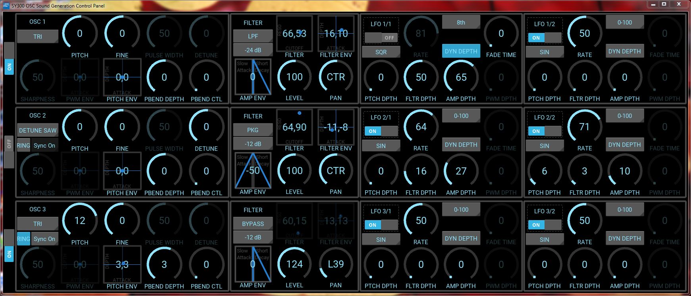
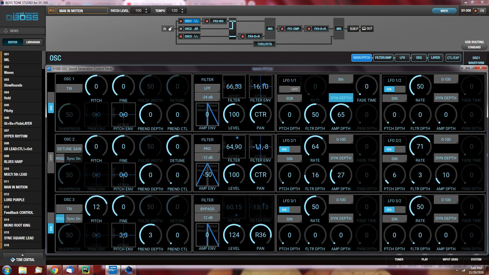

# SY300Panel
Control the sound creation for the Boss SY300 Guitar Synthesizer

**Windows installation directions are at the bottom of this file.**

The SY300Panel is an application that puts all of the controls for the wave/pitch, filter/amp and LFO's on one screen.  The delay in switching between these 3 screens in the Boss Tone Studio was the key motivation for creating this application. 

The application can operate stand-alone, but it is designed to work with the Tone Studio, not replace it.

A few UI highlights:
PWM ENV, PITCH ENV & Filter ENV are all on XY pads that adjust the depth and attack values simultaneously by moving the mouse in the pad. The Cutoff and resonance of the filter and also on an XY pad.  These XY pads are squares with 2 numbers in the center, as show in the image below.

The AMP ENV is adjusted by a custom 'widget' that illustrates the impact of the env generator on attack or decay, slowing the attack or shortening the decay.  The boxes with a blue triangle in the image below are the attack/decay adjustment. 

The circular knobs can be adjusted by clicking and draging the mouse up or down; the mouse scroll wheel can also adjust these knobs.

Below is a screenshot of the SY300Panel on top of BTS.

**Windows Installation Directions:** 
* click on the 'try' directory
* click on the file 'Install_SY300_Panel.zip'
* click the download button
* After the file is downloaded, unzip the file
* In the unzipped directory, open the dist directory, then open the try directory
* Right click on the SY300Panel.exe file, select Create Shortcut, and move the shortcut to the desktop or any location you like.
* Connect your SY300 to your PC, Turn on your SY300 and Click the shortcut.
  
  
